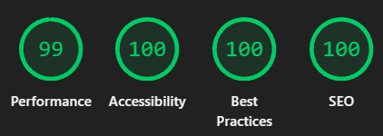
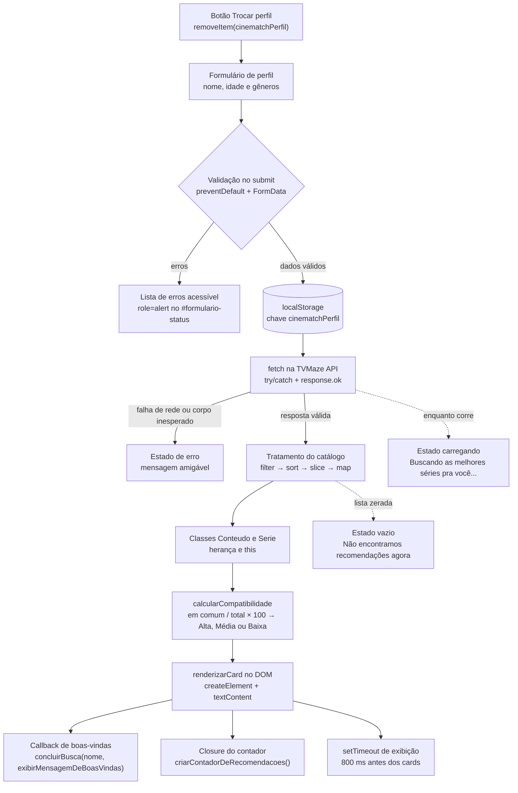

# CineMatch Web

[](https://developer.mozilla.org/pt-BR/docs/Web/HTML)
[](https://developer.mozilla.org/pt-BR/docs/Web/CSS)
[](https://developer.mozilla.org/pt-BR/docs/Web/JavaScript/Guide/Modules)
[](https://www.tvmaze.com/api)
[](https://www.npmjs.com/package/live-server)
[](https://tiagoeduardobr.github.io/CineMatch-Web/)


**Projeto online:** <https://tiagoeduardobr.github.io/CineMatch-Web/> — versão publicada do CineMatch Web, acessível direto pelo navegador, sem instalação.

**Vídeo de apresentação do projeto online:** [https://tiagoeduardobr.github.io/CineMatch-Web/](https://drive.google.com/file/d/1xaInrlU-aX6Bsps12Ud1VAX_ndQ2fKqz/view?usp=sharing) — versão publicada do Vídeo CineMatch Web.

Aplicação de recomendação de séries em tempo real, feita com **HTML5 semântico, CSS3 com Flexbox e JavaScript puro em módulos ES nativos** — sem framework, sem bundler e sem etapa de build.

---

## Resultados do Lighthouse

Após a otimização da imagem principal para `assets/main.jpg`, uma nova auditoria do Lighthouse registrou:

| Categoria | Resultado |
| --- | ---: |
| Performance | **99** |
| Acessibilidade | **100** |
| Boas práticas | **100** |
| SEO | **100** |



*Evidência da auditoria executada no navegador em 04/10/2026.*

---

## O que é e qual problema resolve

O CineMatch Web resolve um problema simples e cotidiano: **descobrir o que assistir sem perder horas navegando catálogos**. A pessoa informa nome, idade e gêneros que gosta; a aplicação busca um catálogo real de séries, compara cada título com o perfil e devolve uma lista curta de recomendações, cada uma com o **percentual de compatibilidade**, os **gêneros em comum**, os **gêneros que a pessoa ainda não explorou** e uma classificação de afinidade (**Alta**, **Média** ou **Baixa**).

O fluxo completo é:

1. **Perfil** — formulário validado (nome, idade e gêneros favoritos).
2. **Catálogo real** — busca na API pública da [TVMaze](https://www.tvmaze.com/api) via `fetch`.
3. **Recomendação** — tratamento do catálogo, cálculo da compatibilidade e cards renderizados no DOM.

É a evolução do **CineMatch JS**, o motor de recomendação que rodava no terminal do Node.js com um catálogo fictício de 30 títulos e `prompt` para entrada de dados. A versão de terminal ficou preservada na pasta [`cinematch_antigo/`](cinematch_antigo/) como registro da entrega original: dela vieram a regra de compatibilidade, as classes `Conteudo` e `Serie`, o callback, a closure e o `setTimeout`, todos portados para módulos ES e para interface web.

---

## Técnicas e linguagens

| Área | O que foi usado |
| --- | --- |
| **Marcação** | HTML5 semântico: `header`, `nav`, `main`, `section`, `article`, `footer`, um único `h1`, `<title>`, `meta description` e og tags |
| **Estilo** | CSS3 mobile-first com **Flexbox** (`flex-direction`, `flex-wrap`, `gap`), box model, media queries e variáveis CSS no `:root`. **Sem CSS Grid e sem `!important`** |
| **Lógica** | JavaScript puro, sem nenhuma biblioteca de runtime: `async`/`await`, classes, funções de ordem superior e métodos de array |
| **Módulos** | Módulos ES nativos: `import` / `export` entre `js/script.js`, `js/ui.js` e `js/modelo.js`, carregados por `<script type="module">` |
| **Rede** | `fetch` com `async`/`await`, `try`/`catch`, validação de `response.ok` e consulta das páginas 0, 1 e 2 da TVMaze |
| **Persistência** | `localStorage` (`setItem`, `getItem`, `removeItem`) em `try`/`catch`, com `JSON.stringify` e `JSON.parse` |
| **POO** | `class`, `extends`, `super()` e `this` |
| **Tempo** | `setTimeout` da Browser API, aplicado na **exibição** do resultado |
| **Servidor** | `live-server` instalado localmente via npm (`devDependencies`) |
| **Acessibilidade e SEO** | landmarks, skip link, `aria-label`, `role="status"` com `aria-live`, `:focus-visible`, contraste conferido contra WCAG AA |

**Stack zero de framework/build:** não há React, Vue, Angular, TypeScript, Webpack, Vite, Babel, Sass nem CSS-in-JS. O único pacote npm do projeto é o `live-server`, ferramenta de apoio para servir os arquivos durante o desenvolvimento.

---

## Como executar

Requisitos: [Node.js](https://nodejs.org/) com npm instalados.

```bash
git clone https://github.com/tiagoeduardobr/CineMatch-Web.git
cd CineMatch-Web
npm install
npm start
```

Depois abra <http://localhost:8080> no navegador.

| Passo | O que faz |
| --- | --- |
| `npm install` | Instala o `live-server` localmente (aparece em `devDependencies`, sem instalação global) |
| `npm start` | Executa o script `"start": "live-server"` do `package.json` e sobe o servidor na porta **8080** |

> ### ⚠️ Aviso importante: módulos ES não funcionam via `file://`
>
> Abrir o `index.html` por **duplo clique** (caminho `file://`) dispara erro de CORS nos `import` e a página fica **sem JavaScript**: o formulário não responde e nenhum card aparece. Módulos ES só carregam servidos por HTTP.
>
> Sirva o projeto sempre com `npm start` e acesse `http://localhost:8080`. O mesmo vale para a publicação: em GitHub Pages a página é servida por uma origem HTTP(S), não por `file://`, por isso o link no topo funciona.

A TVMaze responde com `Access-Control-Allow-Origin: *`, então a chamada não é barrada pelo CORS — dá para confirmar na aba **Network** do DevTools. Nunca desabilite a segurança do navegador para "fazer funcionar".

---

## Estrutura do repositório

```text
CineMatch-Web/
├── index.html            # Página única: HTML semântico, navbar, perfil, resultados, lista e <script type="module">
├── package.json          # Identidade do projeto, "type": "module" e o script "start" do live-server
├── package-lock.json     # Versão exata do live-server resolvida pelo npm
├── README.md             # Este arquivo
├── css/
│   └── style.css         # Folha única: reset, :root com variáveis, Flexbox, cards e media queries (mobile-first)
├── js/
│   ├── script.js         # Fluxo: formulário, localStorage, fetch da TVMaze, tratamento e cálculo
│   ├── ui.js             # Tela: estados da chamada, cards, saudação, contador e atraso de exibição
│   └── modelo.js         # Classes Conteudo e Serie (herança, this) e a fórmula de compatibilidade
├── assets/
│   ├── main.png                          # Capa original preservada como fonte visual
│   ├── main.jpg                          # Capa otimizada usada na página e como og:image
│   ├── lighthouse-resultados.png         # Evidência dos resultados da auditoria Lighthouse
│   └── Captura de tela 2026-09-28 *.png  # Capturas da interface
├── docs/
│   ├── KANBAN.md        # Quadro Kanban do projeto: tarefas, rastreabilidade, riscos e checklist
│   ├── BRIEFING.md      # Transcrição pesquisável do briefing da disciplina
│   └── *.pdf            # Briefing original (fonte de verdade)
├── cinematch_antigo/    # Entrega da semana 6 em Node.js (CommonJS) — só leitura, referência da lógica
│   ├── class.js         # Conteudo, Serie, Filme e criarInstanciaConteudo (module.exports)
│   ├── catalogo.js      # Catálogo fictício de 30 títulos (module.exports)
│   └── cinematch.js     # Menu de terminal, compatibilidade, callback, closure e setTimeout (require)
├── .gitattributes       # Força LF em .md, .js, .css e .html; CRLF em .bat
├── .gitignore           # Ignora node_modules/, logs e arquivos de sistema
├── cspell.json          # Dicionário de termos do Code Spell Checker (configuração de editor)
├── run_opencode_web.bat # Sobe o `opencode web` local e um túnel temporário — ferramenta do ambiente, fora da aplicação
└── AGENTS.md            # Convenções de escrita e restrições de stack do repositório
```

Responsabilidades dos três módulos JavaScript (RF14):

| Arquivo | Responsabilidade | O que **não** faz |
| --- | --- | --- |
| `js/script.js` | Orquestra o fluxo: valida o formulário, persiste o perfil, busca o catálogo e chama o cálculo; controla a troca entre formulário e resultados | Não monta cards nem listas de erros no DOM |
| `js/ui.js` | Componentes visuais: estados da chamada, lista de erros, `renderizarCard`, saudação, contador e `setTimeout` | Não calcula compatibilidade nem controla o fluxo da aplicação |
| `js/modelo.js` | As classes `Conteudo` e `Serie` e a fórmula de compatibilidade | Não acessa `document` nem `localStorage` |

---

## Fluxo da aplicação



Os três estados da chamada (**carregando**, **vazio** e **erro**) escrevem sempre no mesmo `#resultados-status`, que é o elemento com `role="status"` e `aria-live="polite"` — assim a pessoa que usa leitor de tela é avisada de cada mudança sem recarregar a página.

---

## CommonJS vs ESM: qual a diferença?

São dois sistemas de módulos. O **CommonJS** é o do Node.js original; o **ESM** (*ECMAScript Modules*) é o padrão do navegador e a forma usada neste projeto.

### CommonJS — o CineMatch JS original

O mini-projeto de terminal usava `require` para importar e `module.exports` para exportar. Rodava no Node.js, direto no interpretador, sem navegador e sem servidor:

```js
// cinematch_antigo/cinematch.js — CommonJS (Node.js)
const catalogo = require("./catalogo");
const { Conteudo, Serie, Filme, criarInstanciaConteudo } = require("./class");
```

```js
// cinematch_antigo/class.js — CommonJS (Node.js)
module.exports = { Conteudo, Serie, Filme, criarInstanciaConteudo };
```

### ESM — o CineMatch Web

Este projeto usa `import` e `export` nativos, sem nenhuma ferramenta de empacotamento:

```js
// js/script.js — ESM (navegador)
import { Conteudo, Serie } from "./modelo.js";
```

```js
// js/modelo.js — ESM (navegador)
export class Serie extends Conteudo {
  // ...
}
```

### Onde cada um é declarado

| | CommonJS | ESM (este projeto) |
| --- | --- | --- |
| Palavra-chave de import | `require("./class")` | `import { Conteudo } from "./modelo.js"` |
| Palavra-chave de export | `module.exports = { ... }` | `export class ...` / `export function ...` |
| Declaração no pacote | não há — é o comportamento padrão do Node antigo | `"type": "module"` no `package.json` |
| Como o navegador carrega | não carrega — é módulo de servidor | `<script type="module" src="./js/script.js"></script>` no `index.html` |
| Momento da resolução | em tempo de execução | em tempo de parse (e com carregamento assíncrono) |
| Extensão no caminho | opcional | **obrigatória**: `./modelo.js`, não `./modelo` |

Duas consequências práticas no dia a dia do projeto: o caminho do `import` precisa da extensão `.js`, e o `package.json` traz `"type": "module"` porque o mesmo `js/script.js` também é verificado no Node (`node js/script.js`) durante o desenvolvimento.

---

## `const`, `let` e escopo de bloco

A regra do projeto é simples: **`const` por padrão, `let` só quando o valor realmente muda**.

```js
// js/script.js
const CHAVE_PERFIL = "cinematchPerfil"; // nunca é reatribuída → const
let catalogoBruto = [];                 // recebe a resposta da API depois → let
```

`const` não proíbe mutação do **conteúdo** (um array declarado com `const` pode receber `push`), apenas a **reatribuição** da variável. Já `let classificacao`, em `js/modelo.js`, é `let` porque só um dos ramos do `if`/`else` decide o valor final.

### Escopo de bloco na prática

`let` e `const` valem apenas dentro do bloco `{ ... }` em que foram declarados — diferente de `var`, que vaza para a função inteira. Exemplo real do formulário:

```js
// js/script.js — dentro do listener de submit
if (erros.length > 0) {
  const mensagemErros = document.createElement("ul"); // vive só neste if
  mensagemErros.setAttribute("role", "alert");
  formularioStatus.appendChild(mensagemErros);
  return;
}
// mensagemErros não existe aqui fora — o return já aconteceu antes,
// e mesmo sem ele a variável estaria fora de alcance.
```

O mesmo vale para o laço clássico usado na renderização: em `for (let i = 0; i < lista.length; i++)` cada iteração tem o seu próprio `i`, o que evita o erro clássico de captura de variável em laços com closures. E, porque o escopo de bloco existe, o estado do módulo (`const contadorRecomendacoes`, `let catalogoTratado`) é declarado **antes** do guard `typeof document !== "undefined"` — uma `const` declarada depois dele cairia em *temporal dead zone* quando o perfil já estiver salvo.

---

## Por que não usamos `!important`

`!important` não resolve conflito de especificidade: ele **pula a fila de cascata** e passa a valer mesmo quando o seletor errado ganhou a disputa. O resultado é uma folha de estilo difícil de manter — para sobrescrever a regra "importante" é preciso escrever outra ainda mais importante, e o CSS vira uma escada de exceções.

O caminho correto, ensinado no material da disciplina (semana 10, exercício de especificidade), é apenas um destes dois:

1. **Ajustar o seletor** para que ele tenha a especificidade certa — mais específico no lugar certo, ou mais perto no DOM.
2. **Apagar a regra** que está conflitando, porque ela já não deveria existir.

```css
/* Ruim: mascara o conflito e quebra a cascata */
.resultados .card-serie {
  display: flex !important;
}

/* Bem: um único seletor, com a especificidade que o caso exige */
.card-serie {
  display: flex;
}
```

Nenhuma regra do `css/style.css` usa `!important`, e o arquivo também não usa CSS Grid: o layout e a responsividade são resolvidos com Flexbox, classes bem nomeadas e media queries.

---

## Funcionalidades principais

- **Formulário de perfil validado** — nome, idade (`min="1"`) e dez opções de gênero; a validação roda no `submit` com `preventDefault()` e `FormData`, acumula os erros num array e os exibe como lista com `role="alert"` (RF02).
- **Perfil persistido** — salvo em `localStorage` na chave **`cinematchPerfil`**, com `try`/`catch` em leitura e escrita; havendo perfil salvo, o formulário é pulado na próxima visita. O botão **"Trocar perfil"** apaga a chave com `removeItem` e reabre a coleta (RF03).
- **Catálogo real da TVMaze** — `fetch` em `https://api.tvmaze.com/shows?page={0,1,2}` com `try`/`catch`, validação de `response.ok` e guarda de formato, tratando os **três estados**: *carregando*, *vazio* ("Não encontramos recomendações agora") e *erro* com mensagem amigável (RF04).
- **Bônus de catálogo ampliado** — as páginas 0, 1 e 2 da TVMaze são buscadas em paralelo com `Promise.all`; uma falha em qualquer página mantém o estado de erro explícito, sem exibir catálogo parcial.
- **Tratamento com métodos de array** — cadeia `filter` (só títulos com gênero e nota) → `sort` (nota decrescente) → `slice(0, 8)` → `map` (forma normalizada `{ id, titulo, tipo, generos, duracaoMinutos, imagem, avaliacao }`), além dos `filter` que separam gêneros em comum e não explorados (RF05).
- **Classes `Conteudo` e `Serie`** — a base guarda título, tipo, gêneros e duração com `this`, e `Serie` herda por `extends` + `super()` acrescentando temporadas (RF06).
- **Compatibilidade classificada** — fórmula `gêneros em comum ÷ total de gêneros do conteúdo × 100`, com faixas **Alta afinidade** (≥ 80), **Média afinidade** (≥ 50) e **Baixa afinidade**, listando os **gêneros em comum** e os **gêneros não explorados** (RF07).
- **Renderização no DOM** — cada card é um `<article>` montado com `createElement` e escrito com `textContent` (nunca `innerHTML`), o que mantém o dado da API como texto e não como marcação (RF08).
- **Callback** — `concluirBusca(nome, exibirMensagemDeBoasVindas)` recebe a função de saudação como argumento e é quem a dispara no fim da busca (RF10).
- **Closure** — a factory `criarContadorDeRecomendacoes()` mantém um `total` privado, alcançável só pelas funções devolvidas; o contador de **recálculos da compatibilidade** exibido na tela vem dessa closure (RF11).
- **`setTimeout` de exibição** — atraso proposital de 800 ms **na exibição**, nunca dentro do `fetch`, para que a frase de carregando seja percebida sem mascarar o estado de erro (RF12).
- **Responsividade** — layout mobile-first com Flexbox, `flex-wrap` na grade de cards e as três media queries do `css/style.css`: `min-width: 769px` (desktop), `max-width: 768px` e `max-width: 560px` (RF09).
- **SEO e acessibilidade** — `lang="pt-BR"`, `<title>` e `meta description` descritivos, og tags, skip link, landmarks, `aria-label`, `aria-live` e foco visível (RF01 e RF13).
- **Bônus de exploração** — os resultados podem ser filtrados por gênero e ordenados por compatibilidade, avaliação da TVMaze ou título, sem alterar a lista original.
- **Bônus de interface** — o botão da barra de navegação alterna entre o tema escuro padrão e o tema sépia/fantasia clara, com preferência salva em `localStorage`.
- **Bônus de Geolocation** — quando a pessoa autoriza a localização, a aplicação compara latitude e longitude com uma lista local de cidades e personaliza a saudação com a cidade de referência mais próxima; a posição não é persistida nem enviada.
- **Navegação e UX** — a navbar tem âncoras funcionais, estado ativo com `aria-current`, busca local por título, menu responsivo e ações rápidas para pesquisa, tema e perfil.
- **Telas exclusivas** — “Sobre o CineMatch”, “Minha Lista” e “Meu Perfil” ocultam as demais seções enquanto estão abertas; “Início” restaura a tela anterior ou mostra as recomendações quando existe perfil salvo.
- **Registros no Sobre** — a tela Sobre apresenta, em uma galeria horizontal, capturas das funcionalidades e a métrica da auditoria Lighthouse (Performance 99, Acessibilidade 100, Boas práticas 100 e SEO 100).
- **Perfil editável** — o botão de perfil apenas abre o formulário preenchido com os dados salvos; a remoção do perfil fica restrita ao botão explícito “Trocar perfil”.
- **Lista de favoritos** — cards podem ser adicionados ou removidos da lista, persistida em `localStorage` na chave `cinematchFavoritos`.

### Requisitos funcionais cobertos

| RF | Entrega no projeto | RF | Entrega no projeto |
| --- | --- | --- | --- |
| RF01 | HTML semântico e SEO | RF09 | Flexbox e responsividade |
| RF02 | Formulário e validação | RF10 | Callback |
| RF03 | `localStorage` | RF11 | Closure |
| RF04 | `fetch` na TVMaze | RF12 | `setTimeout` (Browser API de tempo) |
| RF05 | Métodos de array | RF13 | SEO básico e acessibilidade |
| RF06 | Classes `Conteudo` e `Serie` | RF14 | Módulos ES (`import`/`export`) |
| RF07 | Compatibilidade e faixas | RF15 | Servir com npm (`live-server`) |
| RF08 | Render no DOM | | |

---

## Decisões e limites dos bônus

- **SVG nativo em vez de Font Awesome:** os ícones da navegação são pequenos, estáticos e já atendem ao uso previsto. SVG inline evita uma dependência externa, carregamento de CDN e configuração adicional, mantendo os ícones acessíveis com `aria-hidden="true"`.
- **Bootstrap não utilizado:** o layout já atende ao briefing com CSS próprio, Flexbox, media queries e tokens de tema. Adicionar Bootstrap aumentaria a superfície de dependências sem resolver uma necessidade real e não mudaria a restrição de não usar CSS Grid.
- **Geolocation opcional:** a recusa da permissão, a indisponibilidade da API ou uma publicação fora de contexto seguro não impedem a busca de recomendações. A cidade é escolhida por proximidade dentro da lista local, seguindo o exercício `ceu-aberto-cidade`; não há reverse geocoding externo.
- **Navegação por telas:** a seção principal, a tela Sobre, a lista de favoritos e o perfil são seções da mesma página. O JavaScript alterna o atributo `hidden` e guarda o estado anterior para que a navegação seja reversível sem recarregar.

## Melhorias possíveis

Itens registrados no [quadro Kanban](docs/KANBAN.md), na coluna *Backlog* — bônus sem nota, para evolução depois da entrega:

- **Combinar com uma API de filmes**, voltando a ter "filmes e séries" como no mini-projeto original.
- **Testes automatizados de interface** para cobrir os estados de rede, filtros, ordenação e persistência de tema.

---

## Créditos e links

| | |
| --- | --- |
| **Disciplina** | Desenvolvimento Mobile — Módulo 01 — Semana 13 (Projeto Avaliativo Final) |
| **Professor** | Matheus de Nadai |
| **Repositório** | <https://github.com/tiagoeduardobr/CineMatch-Web> |
| **Projeto online** | <https://tiagoeduardobr.github.io/CineMatch-Web/> |
| **Quadro Kanban** | [`docs/KANBAN.md`](docs/KANBAN.md) |
| **API de catálogo** | [TVMaze API](https://www.tvmaze.com/api) — pública, sem chave |
| **Autor** | [Tiago](https://github.com/tiagoeduardobr) |
| **Autor** | [Lucas](https://github.com/lucasgd123) |
